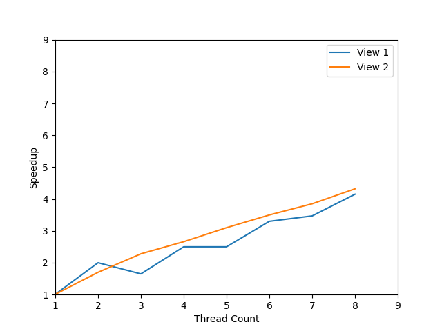
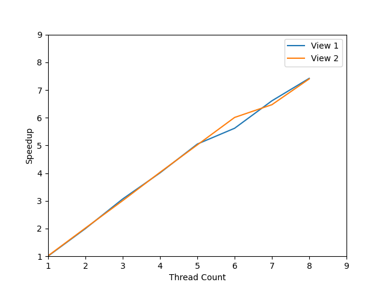

# CS149 Assignment 1 报告

## Program 1 Mandelbrot Thread

1. 使用简单的按行平均划分，实现多线程计算 Mandelbrot 集。

   ```cpp
   const static int rowsPerThread = args->height / args->numThreads;
   const int startRow = args->threadId * rowsPerThread;
   const int totalRows = (args->threadId == args->numThreads - 1)
                          ? args->height - startRow
                          : rowsPerThread;
   mandelbrotSerial(args->x0, args->y0, args->x1, args->y1, args->width,
                    args->height, startRow, totalRows,
                    args->maxIterations, args->output);
   ```

   对于 View 1，使用2线程达到的加速比约 2.00x。
2. 绘制 1 中实现在 [1..8] 线程时工作的加速比折线图：

   

   可以发现总体上而言，线程数越多，加速比越大，但是加速比并非随线程数线性增长，而是逐渐趋于平缓。
   同时，对于 3 个线程的情况，计算 View 1 时加速比反而比 2 个线程的情况低；与 View 2 对照，猜测原因是由于 Mandelbrot 集迭代收敛次数分布不均匀，导致线程间负载不均衡。
3. 添加分线程的时间统计代码，用以确定各线程运行时间

   | Thread Id | Time       |
   | --------- | ---------- |
   | 0         | 97.273 ms  |
   | 1         | 298.658 ms |
   | 2         | 97.202 ms  |

   可以发现，线程 1 的运行时间远大于其他线程，从而降低了加速比。
4. 交错分配行，实现多线程计算 Mandelbrot 集，有效使得各线程负载更均衡。

   ```cpp
   for(unsigned int i = args->threadId; i < args->height; i += args->numThreads) {
       mandelbrotSerial(args->x0, args->y0, args->x1, args->y1, args->width,
                        args->height, i, 1,
                        args->maxIterations, args->output);
   }
   ```

   绘制 [1..8] 线程时工作的加速比折线图：

   
5. 使用 `taskset` 运行程序，限制程序可用 CPU 核心后提高线程数。

   ```shell
   taskset -c 0-3,6-9 ./mandelbrot -t 16 -v 1
   ```

   由于只有 8 个物理线程可用，因此使用 16 个线程时，实际上只有 8 个线程在运行，因此加速比不会有提升，且由于线程切换开销，实际上会降低程序运行效率，最终得到加速比为6.91x。

## Program 2 Vectorization

1. 向量化 `clampExp` 函数，通过调用接口实现
   实现时需要注意可能存在的尾部对齐问题，因此需要对尾部数据进行单独处理。

   ```cpp
   void clampedExpVector(float *values, int *exponents, float *output, int N) {
     static __cs149_vec_int vizero = _cs149_vset_int(0);
     static __cs149_vec_int vione = _cs149_vset_int(1);

     static __cs149_vec_float vfone = _cs149_vset_float(1.f);
     static __cs149_vec_float vfmax = _cs149_vset_float(9.999999f);

     __cs149_vec_float x;
     __cs149_vec_int y;
     __cs149_vec_float result;

     __cs149_mask maskAll = _cs149_init_ones();
     __cs149_mask maskExp, maskClamp;

     int i;
     for (i = 0; i + VECTOR_WIDTH < N; i += VECTOR_WIDTH) {
       // Load vector of values from contiguous memory addresses
       _cs149_vload_float(x, values + i, maskAll); // x = values[i];
       // Load vector of exponents from contiguous memory addresses
       _cs149_vload_int(y, exponents + i, maskAll); // y = exponents[i];
       // Initialize result to 1.f
       _cs149_vmove_float(result, vfone, maskAll); // result = 1.f;

       // Set mask according to predicate
       _cs149_vgt_int(maskExp, y, vizero, maskAll);

       // Execute instruction using mask ("if" clause)
       while (_cs149_cntbits(maskExp)) {
         // result *= x;
         _cs149_vmult_float(result, result, x, maskExp);
         _cs149_vsub_int(y, y, vione, maskExp);
         _cs149_vgt_int(maskExp, y, vizero, maskAll);
       }

       // Clamp values
       _cs149_vgt_float(maskClamp, result, vfmax, maskAll);
       _cs149_vmove_float(result, vfmax, maskClamp);

       // Write results back to memory
       _cs149_vstore_float(output + i, result, maskAll);
     }

     // Handle remaining elements, if any
     if(i == N) return;
     maskAll = _cs149_init_ones(N - i);
     _cs149_vload_float(x, values + i, maskAll);  // x = values[i];
     _cs149_vload_int(y, exponents + i, maskAll); // y = exponents[i];
     _cs149_vmove_float(result, vfone, maskAll); // result = 1.f;

     _cs149_vgt_int(maskExp, y, vizero, maskAll);
     while (_cs149_cntbits(maskExp)) {
       _cs149_vmult_float(result, result, x, maskExp);
       _cs149_vsub_int(y, y, vione, maskExp);
       _cs149_vgt_int(maskExp, y, vizero, maskAll);
     }

     _cs149_vgt_float(maskClamp, result, vfmax, maskAll);
     _cs149_vmove_float(result, vfmax, maskClamp);
     _cs149_vstore_float(output + i, result, maskAll);
     return;
   }
   ```

2. 修改 `VECTOR_WIDTH` 改变向量宽度，比较向量使用率

   | VECTOR_WIDTH | Vector Utilization |
   | ------------ | ------------------ |
   | 2            | 87.6%              |
   | 4            | 82.3%              |
   | 6            | 80.6%              |
   | 8            | 79.6%              |

   向量宽度越大，向量使用率越低，因为更可能发生部分元素被禁用，不参与运算。

3. 求和：使用类似归并的思路，对于各向量内两两相加并交换，存储前一半元素，迭代直到仅剩余一个元素

   ```cpp
   float arraySumVector(float *values, int N) {
     __cs149_mask maskAll = _cs149_init_ones();
     __cs149_mask maskHalf = _cs149_init_ones(VECTOR_WIDTH >> 1);
     __cs149_vec_float vfsum;
     // Each round reduces by half
     while (N > 1) {
       // [0 1 2 3] => [0+1 0+1 2+3 2+3] => [{0+1 2+3} 0+1 2+3]
       for (int i = 0; i < N; i += VECTOR_WIDTH) {
         _cs149_vload_float(vfsum, values + i, maskAll);
         _cs149_hadd_float(vfsum, vfsum);
         _cs149_interleave_float(vfsum, vfsum);
         _cs149_vstore_float(values + (i >> 1), vfsum, maskHalf);
       }
       N >>= 1;
     }
     // Result is stored in values[0]
     return values[0];
   }
   ```
